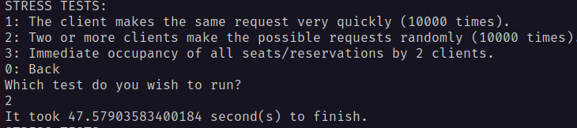

# Report
## Project description
This is the project for the Big Data and Distributed Systems subject for AI 6 semester bachelor studies at PUT.
It models a library, which allows to borrow books on a distributed system. The users can display all books in the library, borrow books, extend or cancel their reservations. 

## Requirements
To run the project, you need:
- [Python](https://www.python.org/)
- [Pipenv](https://pipenv.pypa.io/en/latest/). 
- [Docker](https://www.docker.com/)

## Running the project
First, activate the pipenv and launch the shell.
```bash
pipenv install
pipenv shell
```
Next, you need to launch the docker network and nodes. To do so, use docker compose
```bash
docker compose up -d
```
Finally, run the python script.
```bash
python main.py
```


## Database schema


## Stress Tests Results:
Tests are performed on 1000 randomly generated books.
1. Stress test 1 - the test itself run pretty smoothly. The task is simple, and the book was borrowed only once - the system prevented it from being borrowed again. 

2. Stress test 2 - this test took quite a lot longer to finish. I believe that it might come from the sheer size and random choices included in the test. There are also more 'true' requests commited - the system needs to manage more than 1 book

3. Stress test 3 - this test was much more insightful in it's result. The first attemtps on what I thought was a finished project shown how the locking mechanism was fauty, and did not work as intented.

The fix was using lightweight transactions - locking the resources in a table with IF NOT EXISTS cause, and a signature of which user adds it. It adds some time to the operation, but it solves the problem of overbooking.

As we can see however, due to the CAP theorem there still exist some discrepancies in the borrowed books.
